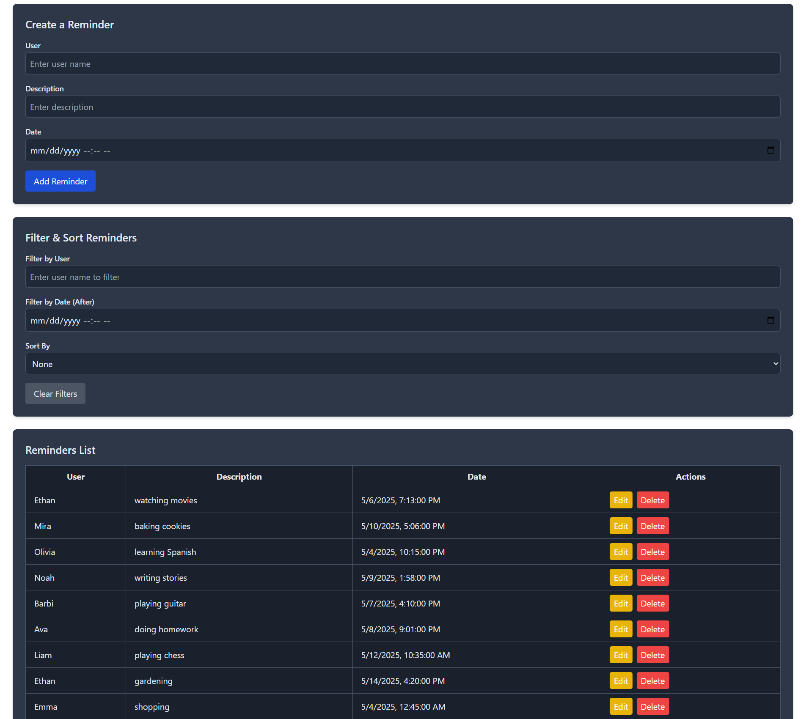

# Reminders App



## Overview
The Reminders App is a web-based application that allows users to create, edit, delete, filter, and sort reminders. It features a responsive design with a toggleable dark mode, built using React, Tailwind CSS, and Axios for API communication. The app connects to a MongoDB backend to store and manage reminders.

## Features
- **Create Reminders**: Add reminders with a user name (string), description, and date/time.
- **Edit Reminders**: Update existing reminders using the same form, with a "Cancel" option to revert.
- **Delete Reminders**: Remove reminders with a confirmation prompt.
- **Filter and Sort**: Filter reminders by user or date (after a specified time), and sort by user or date (newest first).
- **Dark Mode**: Toggle between light and dark themes, with improved visibility for the title in dark mode.
- **Responsive Design**: Works on both desktop and mobile devices.

## Tech Stack
- **Frontend**: React (CDN), Tailwind CSS (CDN), Axios (CDN)
- **Backend**: Node.js/Express with MongoDB (assumed; adjust based on your setup)
- **Deployment**: Local development (http://localhost:3000)

## Prerequisites
- Node.js and npm installed on your machine.
- MongoDB running locally or a MongoDB Atlas connection.
- A web browser (e.g., Chrome, Firefox).

## Setup Instructions
1. **Clone the Repository** (if applicable):
   ```bash
   git clone <repository-url>
   cd reminders-app
   ```

2. **Backend Setup**:
   - Ensure MongoDB is running locally (`mongod`) or set up a MongoDB Atlas connection.
   - Navigate to the backend directory (if separate) and install dependencies:
     ```bash
     npm install
     ```
   - Start the backend server (assumes you have an Express server at `http://localhost:3000`):
     ```bash
     npm start
     ```

3. **Frontend Setup**:
   - Place the `index.html` file in a `public` directory (or serve it directly).
   - The frontend uses CDNs for React, Tailwind CSS, and Axios, so no additional installation is needed.
   - Serve the frontend using a simple HTTP server (e.g., using `http-server` or VS Code Live Server):
     ```bash
     npm install -g http-server
     http-server ./public -p 3000
     ```
   - Alternatively, if integrated with the backend, ensure the backend serves the `index.html` file.

4. **Access the App**:
   - Open your browser and navigate to `http://localhost:3000`.

## Usage
1. **Create a Reminder**:
   - Fill in the "User", "Description", and "Date" fields in the "Create a Reminder" form.
   - Click "Add Reminder" to save the reminder.

2. **Edit a Reminder**:
   - In the "Reminders List", click the "Edit" button next to a reminder.
   - The form will switch to "Edit Reminder" mode, pre-filled with the reminder’s details.
   - Modify the fields and click "Update Reminder" to save changes, or "Cancel" to revert.

3. **Delete a Reminder**:
   - Click the "Delete" button next to a reminder.
   - Confirm the deletion in the prompt to remove the reminder.

4. **Filter and Sort**:
   - Use the "Filter by User" field to filter reminders by user name.
   - Use the "Filter by Date (After)" field to show reminders after a specific date/time.
   - Use the "Sort By" dropdown to sort by user or date (newest first).
   - Click "Clear Filters" to reset all filters.

5. **Toggle Dark Mode**:
   - Click the "Dark Mode" or "Light Mode" button at the top-right to switch themes.

## Project Structure
- **`public/index.html`**: The main frontend file containing the React app, styled with Tailwind CSS.
- **Backend** (assumed structure):
  - `server.js`: Express server handling API routes.
  - `/reminders`: API endpoints for CRUD operations (GET, POST, PATCH, DELETE).
  - MongoDB connection for storing reminders.

## API Endpoints
The app interacts with the following backend API endpoints (assumed; adjust based on your backend):
- `GET /reminders`: Fetch all reminders, with optional query parameters (`user`, `after`, `sortBy`).
- `POST /reminders`: Create a new reminder.
- `PATCH /reminders/:id`: Update an existing reminder.
- `DELETE /reminders/:id`: Delete a reminder.

## Known Issues
- **Dark Mode**: Some areas of the page may not fully apply dark mode; further CSS adjustments are needed.
- **Time Discrepancy**: There’s a 2-hour discrepancy between the set reminder time and the displayed time, likely due to a time zone mismatch (CEST vs. UTC). This needs further investigation on the backend.

## Future Improvements
- Fix the time zone discrepancy by ensuring the backend stores and returns dates with the correct offset.
- Fully resolve dark mode issues for consistent theming across the entire page.
- Add validation for form inputs (e.g., prevent past dates).
- Implement pagination for the reminders list if the dataset grows large.

## License
This project is for personal use and not currently licensed for distribution.
